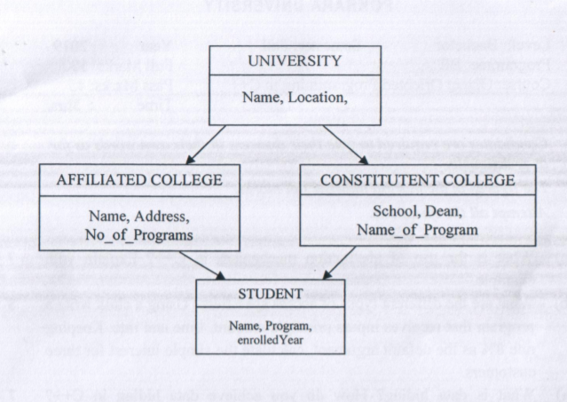

# 2019-Fall

## 1. a) What is the use of abstraction mechanism in C++? Explain with example.

Ans:

## 1. b)What are the different types of access specifiers? Using a class write a program that receives inputs principle amount, time and rate. Keeping rate 8% as the default argument, calculate the simple interest for three customers.

Ans:

## 2. a)What is data hiding? How do you achieve data hiding in C++? 7 Explain with a suitable program.

Ans:

## 2. b) What are the advantage of inheritance? Explain multi-level inheritance with example.

Ans:

## 3. a) How can you overload constructors? Explain with suitable example.

Ans:

## 3. b) What is dynamic memory allocation? How do you allocate memory dynamically in C++? Explain with an example.

Ans: //// not added//

## 4. a)The following figure shows minimum information required for each class. Write a program by realizing the necessary member functions to read and display information of induvidual object. Every class should contain at least one constructor and should be inherited to other classes as well.

Ans:

## 4. b) What do you mean by virtual base class? At which condition it has to be implemented? Explain with suitable example.

Ans:

## 5. a) ) What is operator overloading? Write a program to find the sum and difference of any two complex numbers by overloading `+' and`-' operator.

Ans:

## 5. b) Why is 'this' pointer widely used than object pointer? Write a programme to implement pure polymorphism.

Ans:

## 6. a) What is exception? Explain in brief about the exception handling mechanism in C++.

Ans:

## 6. b) Explain CRC card and sequence diagram with suitable example.

Ans:

## 7. Short notes on:

### 1.Software reusability

### 2. b)Template functions

### 3.c)Software component
