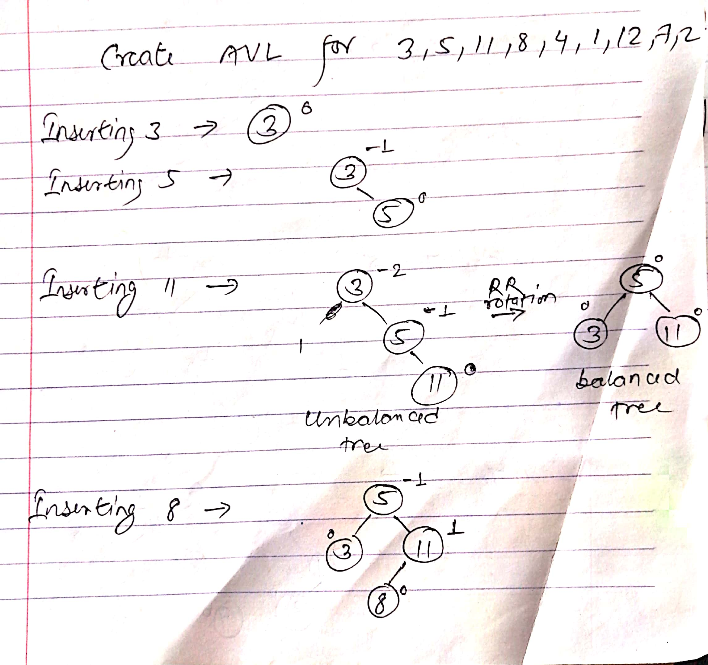
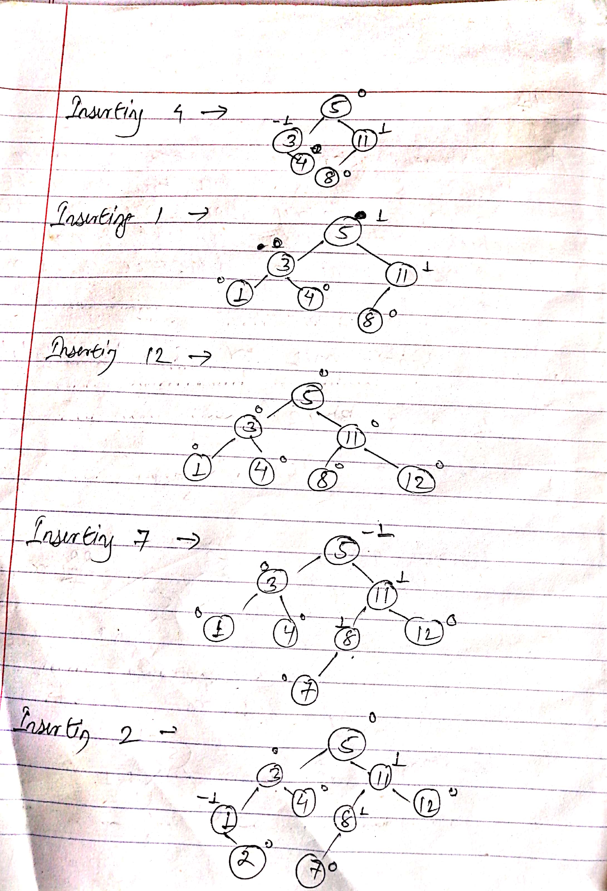
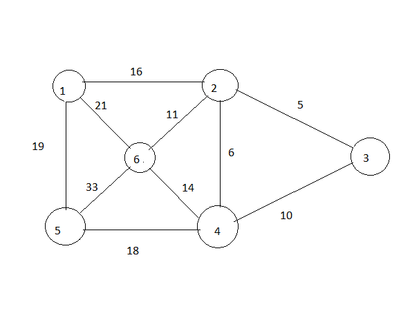

# 2018-Fall

## 1. a) Define ADT with example. What are the data structures used in the following areas: Print jobs in computer, Network data model & Hierarchical data model?

Ans: Abstract Data type (ADT) is a type (or class) for objects whose behaviour is defined by a set of value and a set of operations.
The definition of ADT only mentions what operations are to be performed but not how these operations will be implemented. It does not specify how data will be organized in memory and what algorithms will be used for implementing the operations. It is called “abstract” because it gives an implementation-independent view. The process of providing only the essentials and hiding the details is known as abstraction.
Consider a real life example of a man driving a car. The man only knows that pressing the accelerators will increase the speed of car or applying brakes will stop the car but he does not know about how on pressing accelerator the speed is actually increasing, he does not know about the inner mechanism of the car or the implementation of accelerator, brakes etc in the car.

The data structures used in the following areas:
Print jobs in computer = Queue
Network data model = Graph
Hierarchical data model = Trees

## 1. b) What is the advantage of postfix expression over infix expression?Evaluate the given expression using prefix notation.

```javascript
A * (B +C)—(D / E)
(Assume A= 5, B= 6, C=2, D=12 and E=4)
```

Ans:The advantages of Postfix expression over the Infix expression are as follow:

- Any formula can be expressed without parenthesis.
It is very convenient for evaluating formulas on computer with stacks.
- Postfix expression doesn't has the operator precedence.
- Postfix is slightly easier to evaluate.
- It reflects the order in which operations are performed.
-You need to worry about the left and right associativity.

//You can add the ans if you know it(Fork and pull request)

## 2. a) Write differences between linear queue and circular queue. Write an algorithm for insert and delete operations for circular queue.

Ans:


## 2. b)How many steps are required to solve TOH problem? Write the steps to solve TOH problem for 4 discs giving pictorial illustrations

Ans:For n disks, total 2^n – 1 moves are required.

The steps to solve TOH problem for 4 discs:

1. Move disk 1 from rod A to rod B
2. Move disk 2 from rod A to rod C
3. Move disk 1 from rod B to rod C
4. Move disk 3 from rod A to rod B
5. Move disk 1 from rod C to rod A
6. Move disk 2 from rod C to rod B
7. Move disk 1 from rod A to rod B
8. Move disk 4 from rod A to rod C
9. Move disk 1 from rod B to rod C
10. Move disk 2 from rod B to rod A
11. Move disk 1 from rod C to rod A
12. Move disk 3 from rod B to rod C
13. Move disk 1 from rod A to rod B
14. Move disk 2 from rod A to rod C
15. Move disk 1 from rod B to rod C


## 3. a) Differentiate between static and dynamic list. Write an algorithm to insert a node at the end doubly linked list.

Ans: Static Data structure has fixed memory size whereas in Dynamic Data Structure, the size can be randomly updated during run time which may be considered efficient with respect to memory complexity of the code. Static Data Structure provides more easier access to elements with respect to dynamic data structure. Unlike static data structures, dynamic data structures are flexible.

```javascript
Algorithm to insert a node at the end of Doubly linked list
%% Input : last {Pointer to the last node of doubly linked list}
Begin:
    alloc (newNode)
    If (newNode == NULL) then
        write ('Unable to allocate memory')
    End if
    Else then
        read (data)
        newNode.data ← data;
        newNode.next ← NULL;
        newNode.prev ← last;
        last.next ← newNode;
        last ← newNode;
        write ('Node added successfully at the end of List')
    End else
End
```

## 3. b)What is circular linked list? Write an algorithm for push and pop operations on Stack using linked list.

Ans: Circular linked list is a linked list where all nodes are connected to form a circle. There is no NULL at the end. A circular linked list can be a singly circular linked list or doubly circular linked list.


//second part not added//

## 4. a) Suppose the following list of letters is inserted in order into an empty binary search tree. J R D T G E M H F Q U B. Find the final tree and perform different tree traversals.

Ans:

## 4. b) Write a structure definition to represent AVL tree. Create an AVL tree from the given set of values. 3,5,11,8,4,1,12,7,2

Ans:Named after their inventor Adelson, Velski & Landis, AVL trees are height balancing binary search tree. AVL tree checks the height of the left and the right sub-trees and assures that the difference is not more than 1. This difference is called the Balance Factor.





2018-Fall_4a_1
## 5. a)Trace quick sort for following set of values: 43, 16, 11, 89, 35, 47, 1, 92.

Ans:

## 5. b)Define collision. What are the techniques used for collision resolution in hashing. Explain with example.

Ans: Since a hash function gets us a small number for a key which is a big integer or string, there is a possibility that two keys result in the same value. The situation where a newly inserted key maps to an already occupied slot in the hash table is called collision and must be handled using some collision handling technique.

There are mainly two methods to resolving collision:

1. Separate Chaining
2. Open Addressing

## 6. a) What do you mean by spanning tree of graph? Find the minimal spanning tree of the following graph using Kruskal's algorithm.



Ans: A spanning tree is a subset of Graph G, which has all the vertices covered with minimum possible number of edges. Hence, a spanning tree does not have cycles and it cannot be disconnected..

## 6. b)Explain with suitable example, BFS and DFS traversal of a graph.

Ans: The breadth first search (BFS) and the depth first search (DFS) are the two algorithms used for traversing and searching a node in a graph. They can also be used to find out whether a node is reachable from a given node or not.

Breadth First Traversal (or Search) for a graph is similar to Breadth First Traversal of a tree (See method 2 of this post). The only catch here is, unlike trees, graphs may contain cycles, so we may come to the same node again. To avoid processing a node more than once, we use a boolean visited array. For simplicity, it is assumed that all vertices are reachable from the starting vertex.
For example, in the following graph, we start traversal from vertex 2. When we come to vertex 0, we look for all adjacent vertices of it. 2 is also an adjacent vertex of 0. If we don’t mark visited vertices, then 2 will be processed again and it will become a non-terminating process. A Breadth First Traversal of the following graph is 2, 0, 3, 1.


Depth First Traversal (or Search) for a graph is similar to Depth First Traversal of a tree. The only catch here is, unlike trees, graphs may contain cycles, so we may come to the same node again. To avoid processing a node more than once, we use a boolean visited array.

For example, in the following graph, we start traversal from vertex 2. When we come to vertex 0, we look for all adjacent vertices of it. 2 is also an adjacent vertex of 0. If we don’t mark visited vertices, then 2 will be processed again and it will become a non-terminating process. A Depth First Traversal of the following graph is 2, 0, 1, 3.


## 7. Short notes on:

### 1.Divide and Conquer Algorithm

Like Greedy and Dynamic Programming, Divide and Conquer is an algorithmic paradigm. A typical Divide and Conquer algorithm solves a problem using following three steps.

1. Divide: Break the given problem into subproblems of same type.
2. Conquer: Recursively solve these subproblems
3. Combine: Appropriately combine the answers

Following are some standard algorithms that are Divide and Conquer algorithms.

1) Binary Search
2) Quicksort
3) Merge Sort
4) Closest Pair of Points
5) Strassen’s Algorithm
6) Cooley–Tukey Fast Fourier Transform (FFT) algorithm  etc

### 2.Radix Sort
Radix sort is an integer sorting algorithm that sorts data with integer keys by grouping the keys by individual digits that share the same significant position and value (place value). Radix sort uses counting sort as a subroutine to sort an array of numbers. Because integers can be used to represent strings (by hashing the strings to integers), radix sort works on data types other than just integers. Because radix sort is not comparison based, it is not bounded by \Omega(n \log n)Ω(nlogn) for running time — in fact, radix sort can perform in linear time.
Radix sort incorporates the counting sort algorithm so that it can sort larger, multi-digit numbers without having to potentially decrease the efficiency by increasing the range of keys the algorithm must sort over (since this might cause a lot of wasted time).

Radix sort takes in a list of nn integers which are in base bb (the radix) and so each number has at most dd digits where d=⌊(log b(k)+1)⌋ and k is the largest number in the list. For example, three digits are needed to represent decimal 104104 (in base 10). It is important that radix sort can work with any base since the running time of the algorithm, O(d(n+b)), depends on the base it uses. The algorithm runs in linear time when bb and nn are of the same size magnitude, so knowing nn, bb can be manipulated​ to optimize the running time of the algorithm.
### 3.Worst Case Complexity
